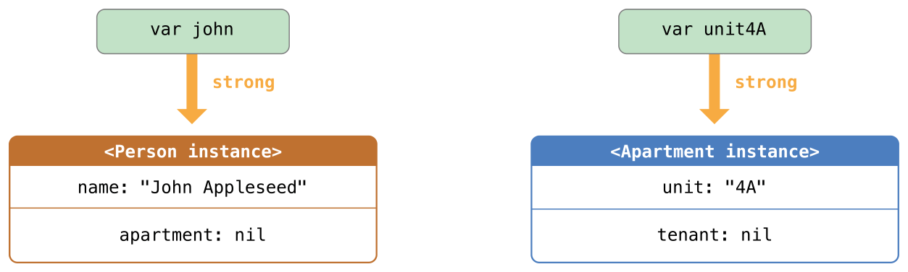
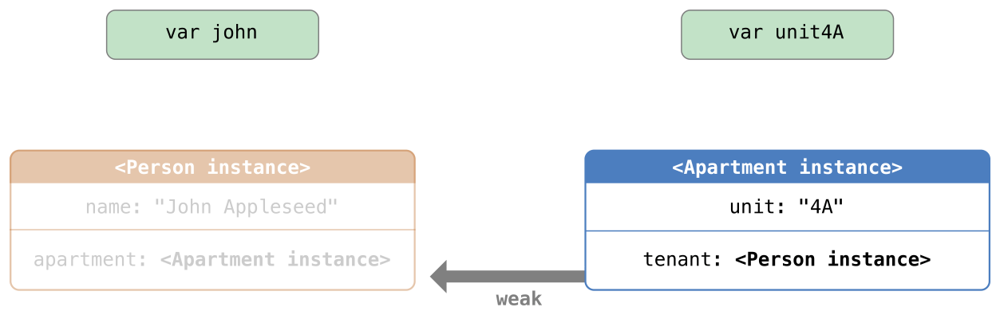

# ARC 自動參考計數
---
內容：
* [ARC工作原理](#how_arc_works)
* [ARC實作](#arc_in_action)
* [類別實例之間的循環強參考](#strong_reference_cycles_between_class_instances)
* [解決實例之間的循環強參考](#resolving_strong_reference_cycles_between_class_instances)
* [閉包引起的循環強參考](#strong_reference_cycles_for_closures)

---

## <a name='how_arc_works'></a> ARC工作原理

ARC會跟蹤每一個實例正被多少屬性、常數和變數所參考，只要實例還被別人參考，ARC就不會釋放此實例的記憶體空間。
<br>
<br>
所以當你指派一個類別實體給屬性、常數或變數時，這些屬性、常數和變數就會對此實例之間建立一個「強參考」。就像一條繩子緊緊綁住實例，被綁住的實例就不會被ARC所釋放掉。

---

## <a name='arc_in_action'></a> ARC實作

```swift
class Person {
    let name: String
    init(name: String) {
        self.name = name
        print("\(name) is being initialized")
    }
    deinit {
        print("\(name) is being deinitialized")
    }
}

var reference1: Person?
var reference2: Person?
var reference3: Person?

reference1 = Person(name: "John Appleseed")
// 輸出: John Appleseed is being initialized

reference2 = reference1
reference3 = reference1
// 現在這個Person實例已經有三個強參考了

reference1 = nil
reference2 = nil
// 只剩下一個強參考，Person實例還不會被銷毀

reference3 = nil
// 輸出: John Appleseed is being deinitialized
```

---

## <a name='strong_reference_cycles_between_class_instances'></a> 類別實例之間的循環強參考

當你建立了兩個實例，並且兩個互相參考時，這種情況就稱為類別實例之間的循環強參考(strong reference cycle)。
```swift
class Person {
    let name: String
    init(name: String) { self.name = name }
    var apartment: Apartment?
    deinit { print("\(name) is being deinitialized") }
}

class Apartment {
    let number: Int
    init(number: Int) { self.number = number }
    var tenant: Person?
    deinit { print("Apartment #\(number) is being deinitialized") }
}

var john: Person?
var number73: Apartment?

john = Person(name: "John Appleseed")
number73 = Apartment(number: 73)
```


再將兩個實例聯繫在一起
```swift
john!.apartment = number73
number73!.tenant = john
```

不幸的是，當你斷開`john`和`number73`變數所持有的強參考時，參考計數並不會降為0，實例也不會被ARC銷毀
```swift
john = nil
number73 = nil
```

`Person`和`Apartment`實例之間的強參考關系保留了下來並且不會被斷開。

---

## <a name='resolving_strong_reference_cycles_between_class_instances'></a> 解決實例之間的循環強參考

Swift 提供了兩種辦法用來解決你在使用類別的屬性時所遇到的迴圈強參考問題
* 弱參考（weak reference）
* 無主參考（unowned reference)

兩個使用時機如下
* 當參考有機會變成nil的情況下使用「弱參考」
* 當初始化後參考就不會變成nil的情況下使用「無主參考」

### 弱參考
弱參考不會牢牢保持住參考的實例，並且不會阻止ARC銷毀被參考的實例。宣告屬性或者變數時，在前面加上`weak`關鍵字表明這是一個弱參考。

>注意:<br>
弱參考必須被宣告為變數，表明其值能在執行時被修改。弱參考不能被宣告為常數。

```swift
class Person {
    let name: String
    init(name: String) { self.name = name }
    var apartment: Apartment?
    deinit { print("\(name) is being deinitialized") }
}

class Apartment {
    let number: Int
    init(number: Int) { self.number = number }
    weak var tenant: Person? // 使用弱參考
    deinit { print("Apartment #\(number) is being deinitialized") }
}

var john: Person?
var number73: Apartment?

john = Person(name: "John Appleseed")
number73 = Apartment(number: 73)

john!.apartment = number73
number73!.tenant = john
```
現在，兩個關聯在一起的實例的參考關系如下圖所示


現在斷開`john`

由於再也沒有指向`Person`實例的強參考，該實例會被銷毀
```swift
john = nil
// 輸出: John Appleseed is being deinitialized
```

現在斷開`number73`

由於再也沒有指向`Apartment`實例的強參考，該實例會被銷毀
```swift
number73 = nil
// 輸出: Apartment #73 is being deinitialized
```
上面的兩段程式碼展示了變數`john`和`number73`在被賦值為`nil`後，`Person`實例和`Apartment`實例的析構函式都列印出「銷毀」的資訊。這證明了參考循環被打破了。

### 無主參考

和弱參考類似，差別是無主參考是永遠有值的。因此，無主參考常用在非可選的屬性或變數上。宣告無主參考使用關鍵字`unowned`。
>注意:<br>
你必須確保參考始終指向一個未銷毀的實例。還需要注意的是如果你試圖存取實例已經被銷毀的無主參考，程式會直接崩潰，而不會發生無法預期的行為。

```swift
class Customer {
    let name: String
    var card: CreditCard?
    init(name: String) {
        self.name = name
    }
    deinit { print("\(name) is being deinitialized") }
}

class CreditCard {
    let number: Int
    unowned let customer: Customer
    init(number: Int, customer: Customer) {
        self.number = number
        self.customer = customer
    }
    deinit { print("Card #\(number) is being deinitialized") }
}

var john: Customer?
john = Customer(name: "John Appleseed")
john!.card = CreditCard(number: 1234_5678_9012_3456, customer: john!)
```

現在，斷開`john`
```swift
john = nil
// 輸出: John Appleseed is being deinitialized
// 輸出: Card #1234567890123456 is being deinitialized
```
最後的程式碼展示了在`john`變數被設為nil後`Customer`實例和`CreditCard`實例的建構函式都列印出了「銷毀」的資訊。

### 無主參考以及隱式解析可選屬性

上面弱參考和無主參考的範例涵蓋了兩種常用的需要打破循環強參考的場景。
* `Person`和`Apartment`的範例展示了兩個屬性的值都允許為`nil`，並會潛在的產生迴圈強參考。這種場景最適合用弱參考來解決。
* `Customer`和`CreditCard`的範例展示了一個屬性的值允許為`nil`，而另一個屬性的值不允許為`nil`，並會潛在的產生迴圈強參考。這種場景最適合通過無主參考來解決。

現在舉例第三種場景，兩個屬性都必須有值，並且初始化完成後不能為`nil`。在這種場景中，需要一個類別使用無主屬性，而另外一個類別使用隱式解析可選屬性。

```swift
class Country {
    let name: String
    var capitalCity: City!
    init(name: String, capitalName: String) {
        self.name = name
        self.capitalCity = City(name: capitalName, country: self)
    }
}

class City {
    let name: String
    unowned let country: Country
    init(name: String, country: Country) {
        self.name = name
        self.country = country
    }
}
```
`Country`的建構函式呼叫了`City`的建構函式。然而，只有`Country`的實例完全初始化完後，`Country`的建構函式才能把`self`傳給`City`的建構函式。
<br><br>
為了滿足這種需求，通過在型別結尾處加上感嘆號（City!）的方式，將`Country`的`capitalCity`屬性宣告為隱式解析可選型別的屬性。由於`capitalCity`預設值為`nil`，一旦`Country`的實例在建構函式中給`name`屬性賦值後，整個初始化過程就完成了。(這代表一旦`name`屬性被賦值後，`Country`的建構函式就能參考並傳遞隱式的`self`)
<br><br>
以上的意義在於你可以通過一條語句同時創建`Country`和`City`的實例，而不產生迴圈強參考，並且`capitalCity`的屬性能被直接存取，而不需要通過驚嘆號來展開它的可選值
```swift
var country = Country(name: "Canada", capitalName: "Ottawa")
print("\(country.name)'s capital city is called \(country.capitalCity.name)")
// 輸出: Canada's capital city is called Ottawa
```
使用隱式解析可選值的意義在於滿足了兩個類別建構函式的需求。`capitalCity`屬性在初始化完成後，能像非可選值一樣使用和存取同時還避免了循環強參考。

---

## <a name='strong_reference_cycles_for_closures'></a> 閉包引起的循環強參考

還有一種情況會發生循環強參考，當你將閉包指派給實例中的屬性時，閉包中又有使用`self`屬性時就會發生。
```swift
class HTMLElement {
    
    let name: String
    let text: String?
    
    lazy var asHTML: () -> String = {
        if let text = self.text {
            return "<\(self.name)>\(text)</\(self.name)>"
        } else {
            return "<\(self.name) />"
        }
    }
    
    init(name: String, text: String? = nil) {
        self.name = name
        self.text = text
    }
    
    deinit {
        print("\(name) is being deinitialized")
    }
}

var paragraph: HTMLElement? = HTMLElement(name: "p", text: "hello, world")
print(paragraph!.asHTML())
// 輸出: <p>hello, world</p>
```

>注意：<br>
雖然閉包多次使用了self，它只捕獲HTMLElement實例的一個強參考。

### 解決閉包引起的循環強參考

這時候就要使用「捕獲列表」來解決這種強參考的發生。捕獲列表可以將閉包捕獲的實例參考定義為弱參考或無主參考。
>注意:<br>
Swift 有如下要求：只要在閉包內使用self的成員，就要用self.someProperty或者self.someMethod（而不只是someProperty或someMethod）。這提醒你可能會不小心就捕獲了self。

### 定義捕獲列表

捕獲列表中的每個元素都是由`weak`或者`unowned`關鍵字和實例的參考(如`self`或`someInstance`)成對組成。<br>
<br>
捕獲列表格式
```swift
[weak/unowned 實例, weak/unowned 實例, ...]
```
捕獲列表放置在閉包參數列表和回傳型別之前
```swift
lazy var someClosure: (Int, String) -> String = {
    [unowned self] (index: Int, stringToProcess: String) -> String in
    // closure body goes here
}
```
如果閉包沒有指定參數列表或者回傳型別，則可以通過上下文推斷，那麼可以捕獲列表放在閉包開始的地方，跟著是關鍵字`in`
```swift
lazy var someClosure: () -> String = {
    [unowned self] in
    // closure body goes here
}
```
### 弱參考和無主參考

決定使用弱參考或無主參考
* [無主參考]<br>
閉包和實例之間總是同時被參考及同時被銷毀
* [弱參考]<br>
閉包捕獲的參考有可能為`nil`

>注意：<br>
如果捕獲的參考絕對不會置為nil，應該用無主參考，而不是弱參考。

```swift
class HTMLElement {
    
    let name: String
    let text: String?
    
    lazy var asHTML: () -> String = {
        [unowned self] in
        if let text = self.text {
            return "<\(self.name)>\(text)</\(self.name)>"
        } else {
            return "<\(self.name) />"
        }
    }
    
    init(name: String, text: String? = nil) {
        self.name = name
        self.text = text
    }
    
    deinit {
        print("\(name) is being deinitialized")
    }
}

var paragraph: HTMLElement? = HTMLElement(name: "p", text: "hello, world")
print(paragraph!.asHTML())
// 輸出: <p>hello, world</p>
```

這一次，閉包以無主參考的形式捕獲`self`，並不會持有`HTMLElement`實例的強參考。如果將`paragraph`賦值為`nil`，`HTMLElement`實例將會被銷毀，並能看到它的解構函式列印出的訊息。
```swift
paragraph = nil
// 輸出: p is being deinitialized
```

---