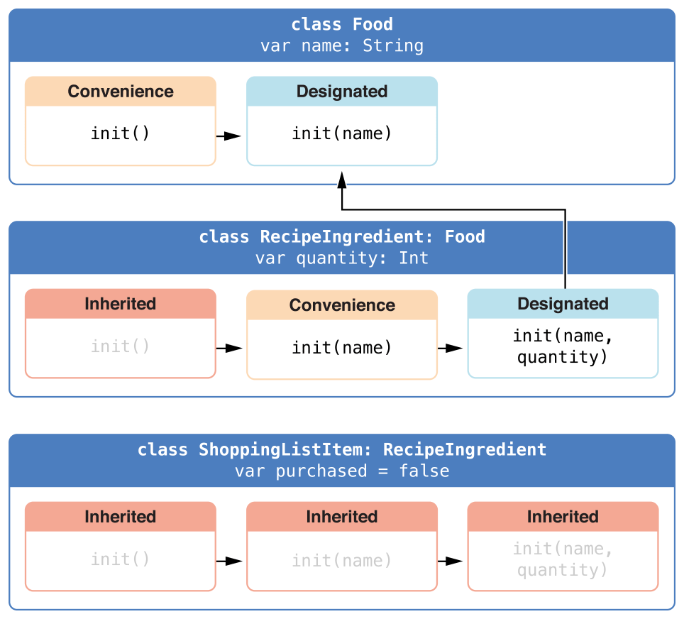

# Initialization 建構過程
---
內容：
* [儲存型屬性的初始賦值](#setting_initial_values_for_stored_properties)
* [定制化建構過程](#customizing_initialization)
* [預設建構器](#default_initializers)
* [值型別的建構器代理](#initializer_delegation_for_value_types)
* [類別的繼承和建構過程](#class_inheritance_and_initialization)
* [通過閉包和函式來設置屬性的預設值](#setting_a_default_property_value_with_a_closure_or_function)

---

建構過程是為了使用某個類別、結構或列舉型別的實例而進行的準備過程。這個過程包含了為實例中的每個屬性設置初始值和為其執行必要的準備和初始化任務

## <a name='setting_initial_values_for_stored_properties'></a> 儲存型屬性的初始賦值

類別和結構在實例創建時，必須為所有儲存型屬性設置合適的初始值。儲存型屬性的值不能處於一個未知的狀態

>注意：<br>
當你為儲存型屬性設置預設值或者在建構器中為其賦值時，它們的值是被直接設置的，不會觸發任何屬性觀測器

### 建構器
```swift
struct Fahrenheit {
    var temperature: Double
    init() {
        temperature = 32.0
    }
}

var f = Fahrenheit()
print("The default temperature is \(f.temperature)° Fahrenheit")
// 輸出: The default temperature is 32.0° Fahrenheit
```

### 預設屬性值

```swift
struct Fahrenheit {
    var temperature = 32.0
}
```

## <a name='customizing_initialization'></a> 定制化建構過程

你可以通過輸入參數和可選屬性型別來定制建構過程，也可以在建構過程中修改常數屬性

### 建構參數

```swift
struct Celsius {
    var temperatureInCelsius: Double = 0.0
    init(fromFahrenheit fahrenheit: Double) {
        temperatureInCelsius = (fahrenheit - 32.0) / 1.8
    }
    init(fromKelvin kelvin: Double) {
        temperatureInCelsius = kelvin - 273.15
    }
}

let boilingPointOfWater = Celsius(fromFahrenheit: 212.0)
// boilingPointOfWater.temperatureInCelsius 是 100.0
let freezingPointOfWater = Celsius(fromKelvin: 273.15)
// freezingPointOfWater.temperatureInCelsius 是 0.0
```

### 可選屬性型別

如果你定制的型別包含一個邏輯上允許取值為空的儲存型屬性--不管是因為它無法在初始化時賦值，還是因為它可以在之後某個時間點可以賦值為空--你都需要將它定義為可選型別optional type。可選型別的屬性將自動初始化為空nil

---

## <a name='default_initializers'></a> 預設建構器

Swift 將為所有屬性已提供預設值的且自身沒有定義任何建構器的結構或基類別，提供一個預設的建構器

```swift
class ShoppingListItem {
    var name: String?
    var quantity = 1
    var purchased = false
}

var item = ShoppingListItem()
```

### 結構的逐一成員建構器
如果結構對所有儲存型屬性提供了預設值且自身沒有提供定制的建構器，它們能自動獲得一個逐一成員建構器
```swift
struct Size {
    var width = 0.0, height = 0.0
}
let twoByTwo = Size(width: 2.0, height: 2.0)
```

---

## <a name='initializer_delegation_for_value_types'></a> 值型別的建構器代理

建構器可以通過呼叫其它建構器來完成實例的部分建構過程。這一過程稱為建構器代理，它能減少多個建構器間的程式碼重複
```swift
struct Size {
    var width = 0.0, height = 0.0
}
struct Point {
    var x = 0.0, y = 0.0
}

struct Rect {
    var origin = Point() 
    var size = Size()
    init() {}
    init(origin: Point, size: Size) {
        self.origin = origin
        self.size = size
    }
    init(center: Point, size: Size) {
        let originX = center.x - (size.width / 2)
        let originY = center.y - (size.height / 2)
        self.init(origin: Point(x: originX, y: originY), size: size)
    }
}

let basicRect = Rect()
// basicRect 的原點是 (0.0, 0.0)，尺寸是 (0.0, 0.0)

let originRect = Rect(origin: Point(x: 2.0, y: 2.0), size: Size(width: 5.0, height: 5.0))
// originRect 的原點是 (2.0, 2.0)，尺寸是 (5.0, 5.0)
```

>注意:<br>
如果你想用另外一種不需要自己定義init()和init(origin:size:)的方式來實作這個範例，請參考擴展。

---

## <a name='class_inheritance_and_initialization'></a> 類別的繼承和建構過程

類別裡面的所有儲存型屬性--包括所有繼承自父類別的屬性--都必須在建構過程中設置初始值。Swift 提供了兩種型別的類別建構器來確保所有類別實例中儲存型屬性都能獲得初始值

* 指定建構器
* 便利建構器

### 指定建構器和便利建構器

* 指定建構器<br>
是類別中最主要的建構器。一個指定建構器將初始化類別中提供的所有屬性，並根據父類別鏈往上呼叫父類別的建構器來實作父類別的初始化。每一個類別都必須擁有至少一個指定建構器。

* 便利建構器<br>
輔助型的建構器。你可以定義便利建構器來呼叫同一個類別中的指定建構器，並為其參數提供預設值。你也可以定義便利建構器來創建一個特殊用途或特定輸入的實例。


### 建構器鏈

Swift 采用以下三條規則來限制建構器之間的代理呼叫：

* 規則1<br>
指定建構器必須呼叫其直接父類別的的指定建構器。

* 規則2<br>
便利建構器必須呼叫同一類別中定義的其它建構器。

* 規則3<br>
便利建構器必須最終以呼叫一個指定建構器結束。

一個更方便記憶的方法是：
* 指定建構器必須總是向上代理
* 便利建構器必須總是橫向代理


### 兩段式建構過程
Swift 中類別的建構過程包含兩個階段
* 第一階段<br>
每個儲存型屬性通過引入它們的類別的建構器來設置初始值。當每一個儲存型屬性值被確定後，開始第二階段
* 第二階段<br>
它給每個類別一次機會在新實例準備使用之前進一步定制它們的儲存型屬性

Swift 編譯器將執行 4 種有效的安全檢查，以確保兩段式建構過程能順利完成：
* <h3>安全檢查1</h3>
指定建構器必須保證它所在類別引入的所有屬性都必須先初始化完成，之後才能將其它建構任務向上代理給父類別中的建構器。
* <h3>安全檢查2</h3>
指定建構器必須先向上代理呼叫父類別建構器，然後再為繼承的屬性設置新值。如果沒這麼做，指定建構器賦予的新值將被父類別中的建構器所覆蓋。
* <h3>安全檢查3</h3>
便利建構器必須先代理呼叫同一類別中的其它建構器，然後再為任意屬性賦新值。如果沒這麼做，便利建構器賦予的新值將被同一類別中其它指定建構器所覆蓋。
* <h3>安全檢查4</h3>
建構器在第一階段建構完成之前，不能呼叫任何實例方法、不能讀取任何實例屬性的值，也不能參考self的值。

<br>
以下是兩段式建構過程中基於上述安全檢查的建構流程展示

### 階段1
* 某個指定建構器或便利建構器被呼叫
* 完成新實例內存的分配，但此時內存還沒有被初始化
* 指定建構器確保其所在類別引入的所有儲存型屬性都已賦初值。儲存型屬性所屬的內存完成初始化
* 指定建構器將呼叫父類別的建構器，完成父類別屬性的初始化
* 這個呼叫父類別建構器的過程沿著建構器鏈一直往上執行，直到到達建構器鏈的最頂部
* 當到達了建構器鏈最頂部，且已確保所有實例包含的儲存型屬性都已經賦值，這個實例的內存被認為已經完全初始化。此時階段1完成。

### 階段2
* 從頂部建構器鏈一直往下，每個建構器鏈中類別的指定建構器都有機會進一步定制實例。建構器此時可以存取`self`、修改它的屬性並呼叫實例方法等等
* 最終，任意建構器鏈中的便利建構器可以有機會定制實例和使用`self`。

子類別和父類別之間建構的階段1：

1. 建構過程從對子類別中一個便利建構器的呼叫開始。這個便利建構器此時沒法修改任何屬性，它把建構任務代理給同一類別中的指定建構器。
2. 如安全檢查1所示，指定建構器將確保所有子類別的屬性都有值。然後它將呼叫父類別的指定建構器，並沿著造器鏈一直往上完成父類別的構建過程。
3. 父類別中的指定建構器確保所有父類別的屬性都有值。由於沒有更多的父類別需要構建，也就無需繼續向上做構建代理。
4. 一旦父類別中所有屬性都有了初始值，實例的內存被認為是完全初始化，而階段1也已完成。

以下展示了相同建構過程的階段2：

1. 父類別中的指定建構器現在有機會進一步來定制實例（儘管它沒有這種必要）。
2. 一旦父類別中的指定建構器完成呼叫，子類別的構指定建構器可以執行更多的定制操作（同樣，它也沒有這種必要）。
3. 最終，一旦子類別的指定建構器完成呼叫，最開始被呼叫的便利建構器可以執行更多的定制操作。

### 建構器的繼承和重載

與 Objective-C 中的子類別不同，Swift中的子類別不會預設繼承父類別的建構器。這種機制可以防止一個父類別的簡單建構器被一個更專業的子類別繼承，並被錯誤的用來創建子類別的實例。
<br>
如果你希望子類別中可以有一個或多個和父類別相同的建構器，可以在子類別覆寫父類別的「指定建構器」(在子類別建構器前加上`override`)
<br>
如果你重載的建構器是一個便利建構器，你的重載過程必須通過呼叫同一類別中提供的其它指定建構器來實作。

### 自動建構器的繼承

子類別不會預設繼承父類別的建構器。但是如果特定條件可以滿足，父類別建構器是可以被自動繼承的。

* <h3>規則1</h3>
如果子類別沒有定義任何指定建構器，它將自動繼承所有父類別的指定建構器。
* <h3>規則2</h3>
如果子類別提供了所有父類別指定建構器的實作--不管是通過規則1繼承過來的，還是通過自定義實作的--它將自動繼承所有父類別的便利建構器。

<br>
即使你在子類別中添加了更多的便利建構器，這兩條規則仍然適用。
>注意:<br>
子類別可以通過部分滿足規則2的方式，使用子類別便利建構器來實作父類別的指定建構器。

### 指定建構器和便利建構器的語法與實作

類別的指定建構器的寫法跟值型別簡單建構器一樣
```swift
init(parameters) {
    // statements
}
```
便利建構器也采用相同樣式的寫法，但需要在`init`關鍵字之前放置`convenience`關鍵字
```swift
convenience init(parameters) {
    // statements
}
```
以類別`Food`舉例
```swift
class Food {
    var name: String
    init(name: String) {
        self.name = name
    }
    convenience init() {
        self.init(name: "[Unnamed]")
    }
}

let namedMeat = Food(name: "Bacon")
// namedMeat 的名字是 Bacon

let mysteryMeat = Food()
// mysteryMeat 的名字是 [Unnamed]
```


第二個類別是`Food`的子類別`RecipeIngredient`
```swift
class RecipeIngredient: Food {
    var quantity: Int
    init(name: String, quantity: Int) {
        self.quantity = quantity
        super.init(name: name)
    }
    convenience override init(name: String) {
        self.init(name: name, quantity: 1)
    }
}

let oneMysteryItem = RecipeIngredient()
// name:[Unnamed] quantity:1
let oneBacon = RecipeIngredient(name: "Bacon")
// name:Bacon quantity:1
let sixEggs = RecipeIngredient(name: "Eggs", quantity: 6)
// name:Eggs quantity:6
```
注意，`RecipeIngredient`的便利建構器使用了跟`Food`中指定建構器相同的參數。儘管`RecipeIngredient`這個建構器是便利建構器，`RecipeIngredient`依然提供了對所有父類別指定建構器的實作。因此，`RecipeIngredient`也能自動繼承了所有父類別的便利建構器。


第三個類別是`RecipeIngredient`的子類別`ShoppingListItem`
```swift
class ShoppingListItem: RecipeIngredient {
    var purchased = false
    var description: String {
    var output = "\(quantity) * \(name.lowercaseString)"
        output += purchased ? " ✔" : " ✘"
        return output
    }
}
```
由於它為自己引入的所有屬性都提供了預設值，並且自己沒有定義任何建構器，`ShoppingListItem`將自動繼承所有父類別中的指定建構器和便利建構器。


```swift
var breakfastList = [
    ShoppingListItem(),
    ShoppingListItem(name: "Bacon"),
    ShoppingListItem(name: "Eggs", quantity: 6),
]
breakfastList[0].name = "Orange juice"
breakfastList[0].purchased = true
for item in breakfastList {
    print(item.description)
}

/*
1 * orange juice ✔
1 * bacon ✘
6 * eggs ✘
*/
```

---

## <a name='setting_a_default_property_value_with_a_closure_or_function'></a> 通過閉包和函式來設置屬性的預設值

如果某個儲存型屬性的預設值需要特別的定制或準備，你可以使用閉包或全域函式來為屬性提供預設值，其中他們的回傳值會當做成預設值賦值給屬性。
```swift
class SomeClass {
    let someProperty: SomeType = {
        
        // someValue 必須和 SomeType 型別相同
        return someValue
        }() // 加上括號代表將閉包回傳值someValue指派給someProperty
}

```
>注意：<br>
如果你使用閉包來初始化屬性的值，請記住在閉包執行時，實例的其它部分都還沒有初始化。這意味著你不能夠在閉包裡存取其它的屬性，就算這個屬性有預設值也不允許。同樣，你也不能使用隱式的self屬性，或者呼叫其它的實例方法。

下面範例定義一個結構`Checkerboard`

```swift
struct Checkerboard {
    let boardColors: [Bool] = {
        var temporaryBoard = [Bool]()
        var isBlack = false
        for i in 1...10 {
            for j in 1...10 {
                temporaryBoard.append(isBlack)
                isBlack = !isBlack
            }
            isBlack = !isBlack
        }
        return temporaryBoard
    }()
    func squareIsBlackAtRow(row: Int, column: Int) -> Bool {
        return boardColors[(row * 10) + column]
    }
}

let board = Checkerboard()
print(board.squareIsBlackAtRow(0, column: 1))
// 輸出 "true"
print(board.squareIsBlackAtRow(9, column: 9))
// 輸出 "false"
```
上面範例中描述的閉包將計算出棋盤中每個格子合適的顏色，將這些顏色值保存到一個臨時陣列`temporaryBoard`中，並在構建完成時將此陣列作為閉包回傳值回傳。這個回傳的值將保存到`boardColors`中

---